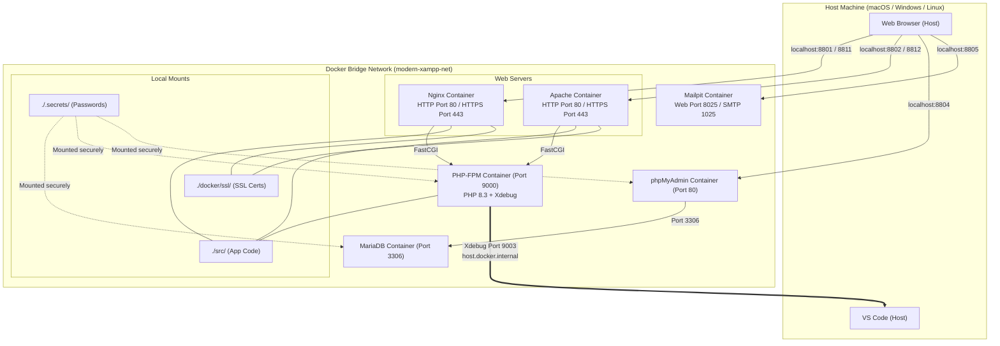

# Modern Decoupled PHP & Web Development Environment

Welcome to your next-generation, high-performance local development stack. This environment replaces the monolithic, heavy XAMPP-in-Docker anti-pattern with a modern, decoupled, and secure microservices architecture. 

It is designed to give you maximum flexibility: running **Nginx** and **Apache** concurrently, serving both **HTTP and HTTPS (via self-signed SSL)**, pointing to the same PHP-FPM service, and managing credentials securely with **Docker Secrets**. It also integrates seamless, out-of-the-box **VS Code Xdebug step-by-step debugging**.

---

## 🏛️ System Architecture Diagram



---

## ✨ Features & Technologies

*   🚀 **Central PHP-FPM Engine**: Customized Alpine container (`php:8.3-fpm-alpine`) with crucial extensions (`gd`, `zip`, `intl`, `opcache`, `apcu`, `pdo_mysql`, `mysqli`, `xdebug`) and the latest **Composer** built-in.
*   🔒 **Dual Web Servers with SSL (Concurrent & Exclusive Ports)**:
    *   **Nginx**: HTTP served on `8801`, HTTPS (SSL) served on `8811`.
    *   **Apache**: HTTP served on `8802`, HTTPS (SSL) served on `8812` (supporting standard `.htaccess` overrides).
*   🔑 **Security (Docker Secrets)**: Database passwords are never exposed in plaintext. They are loaded dynamically from files in `.secrets/`.
*   🐛 **Pre-configured Xdebug 3**: Fully configured to trace code executions back to your VS Code session at port `9003` via host loopback.
*   📬 **Integrated Mail Catcher (Mailpit)**: SMTP is mapped on `8825` and the visual browser interface is on `8805`.
*   📂 **phpMyAdmin Database Tool**: Visual database admin console active on port `8804`.
*   🟢 **Node.js LTS (Asset Builder)**: Independent `node:20-alpine` service with port `5173` mapped for **Vite** hot-reload (HMR) to compile modern JS/CSS.

---

## 🛠️ Prerequisites

1.  **Docker Desktop** (macOS, Windows, or Linux) with Docker Compose.
2.  **Visual Studio Code** with the **[PHP Debug](https://marketplace.visualstudio.com/items?itemName=xdebug.php-debug)** extension installed.

---

## 🚀 Quickstart Guide

### 1. Initialize Settings & SSL
All files, local settings, and certificates have been **pre-generated** inside this workspace.
*   Port mappings reside in `.env`.
*   Secure database passwords reside in `.secrets/`.
*   Self-signed SSL certificates reside in `docker/ssl/` (`server.crt` and `server.key`).

> [!TIP]
> The `.secrets/` directory, `.env` file, and `docker/ssl/` certificates are automatically ignored by Git (via `.gitignore`), guaranteeing secure commits when you push to a remote repository.

### 2. Boot Up the Environment
Start the services in detached mode:
```bash
docker compose up -d --build
```
This will compile the PHP container and launch all of the microservices.

### 3. Check the Status Page
Navigate in your browser to:
*   **Nginx**:
    *   HTTP: [http://localhost:8801](http://localhost:8801)
    *   HTTPS: [https://localhost:8811](https://localhost:8811) *(Accept the self-signed browser security warning)*
*   **Apache**:
    *   HTTP: [http://localhost:8802](http://localhost:8802)
    *   HTTPS: [https://localhost:8812](https://localhost:8812) *(Accept the self-signed browser security warning)*

You will see the dark-mode dashboard displaying connection statuses and diagnostics.

---

## 🐛 Walkthrough: Debugging with VS Code & Xdebug

To start debugging your PHP code step-by-step:

1.  **Open the Project**: Open the root of this folder in VS Code.
2.  **Place a Breakpoint**:
    *   Open `src/index.php`.
    *   Go to **Line 54** (`$test_variable = "Xdebug Connection Working Successfully!";`).
    *   Click on the left gutter to place a red dot (Breakpoint).
3.  **Start Debugger Listener**:
    *   Press `F5` (or click on the **Run & Debug** tab in the sidebar, select **"Listen for Xdebug (Docker)"**, and click the green Play button).
4.  **Trigger the Breakpoint**:
    *   Open the status dashboard in your browser ([http://localhost:8801](http://localhost:8801) or [https://localhost:8811](https://localhost:8811)).
    *   Click the purple **⚡ Trigger Breakpoint Test** button.
5.  **Analyze!**:
    *   VS Code will instantly pull itself to the foreground, pausing the line execution! You can inspect local variables and step through the script.

---

## 📦 Compiling Frontend Assets (Node.js & npm)

This stack includes an independent Node.js container to manage and compile your frontend assets (CSS, JS, Tailwind, Vite, Webpack, etc.) without polluting the PHP engine.

Since the `src/` folder is mounted in the container at `/var/www/html`, you can run `npm` commands easily:

*   **Install dependencies**:
    ```bash
    docker compose exec node npm install
    ```
*   **Run a development compiler (e.g. Vite dev server)**:
    ```bash
    docker compose exec node npm run dev
    ```
    *(Vite will serve assets on port `5173`, which is already exposed to your host machine!)*
*   **Compile production assets**:
    ```bash
    docker compose exec node npm run build
    ```
*   **Install a new npm package**:
    ```bash
    docker compose exec node npm install tailwindcss postcss autoprefixer
    ```

---

## 🔒 Managing Secrets

To change your database credentials:
1.  Open `.secrets/db_password.txt` and `.secrets/db_root_password.txt` and change the text strings.
2.  Run `docker compose down` and `docker compose up -d` to restart the database and reload the secrets.

In your PHP code, connect using:
```php
$db_password = trim(file_get_contents(getenv('DB_PASSWORD_FILE')));
$dsn = "mysql:host=" . getenv('DB_HOST') . ";dbname=" . getenv('DB_DATABASE');
$pdo = new PDO($dsn, getenv('DB_USER'), $db_password);
```

---

## 🛑 Stopping and Maintenance

*   Stop services (retaining data): `docker compose stop`
*   Start services back up: `docker compose start`
*   Tear down completely (retaining SQL database volume): `docker compose down`
*   Tear down everything (including persistent database tables): `docker compose down -v`
